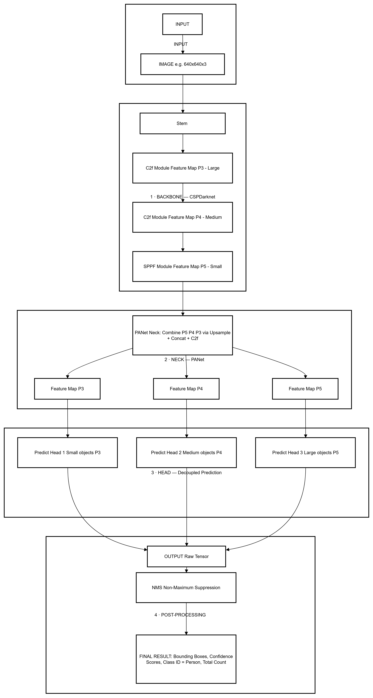
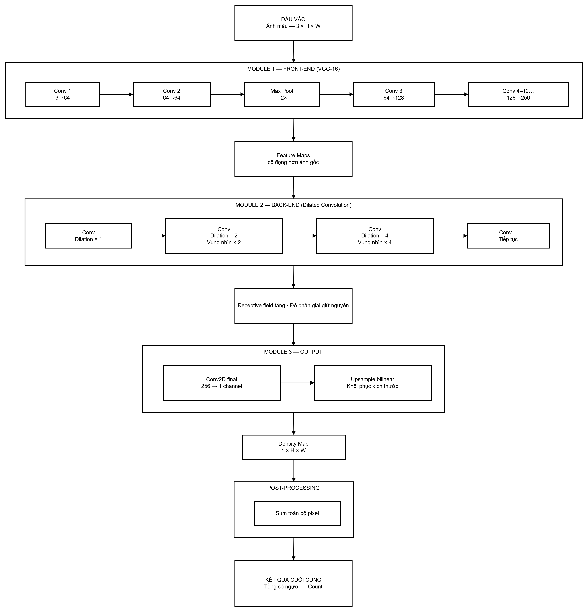

# Kiến trúc Các Mô hình Nhận diện và Đếm Người

Tài liệu này mô tả chi tiết luồng xử lý dữ liệu của 2 phương pháp được sử dụng trong đề tài: Phương pháp dựa trên phát hiện vật thể (YOLOv8) và Phương pháp dựa trên bản đồ mật độ (CSRNet).

---

## Phần 1: Phương pháp 1 - Kiến trúc YOLOv8 (Object Detection)

### 1.1. Sơ đồ Tổng quan


### 1.2. Giải thích các thành phần chính
Kiến trúc được chia thành 4 thành phần chính:

1.  **Đầu vào (Input):**
    Mô hình nhận đầu vào là ảnh màu (RGB). Kích thước ảnh tiêu chuẩn thường là $640 \times 640$ pixels. Tuy nhiên, đối với bài toán đám đông mật độ cao, nhóm dự kiến thử nghiệm tăng kích thước đầu vào (ví dụ: $1024 \times 1024$ hoặc giữ nguyên độ phân giải gốc nếu phần cứng cho phép) để giúp mô hình nhìn rõ các đối tượng nhỏ ở xa.

2.  **Backbone (Xương sống):**
    Sử dụng biến thể cải tiến của CSPDarknet. Thành phần cốt lõi là các block **C2f** (Cross Stage Partial bottleneck with two convolutions). C2f giúp trích xuất các đặc trưng hình ảnh mạnh mẽ (từ cạnh, góc đến hình dáng phức tạp) trong khi vẫn đảm bảo tốc độ tính toán nhanh nhờ việc giảm bớt các tham số thừa. Cuối Backbone là module **SPPF** (Spatial Pyramid Pooling - Fast) giúp tăng cường trường nhìn (receptive field) để mô hình hiểu ngữ cảnh tốt hơn mà không làm giảm tốc độ.

3.  **Neck (Cổ mạng):**
    YOLOv8 sử dụng cấu trúc **PANet** (Path Aggregation Network). Nhiệm vụ của Neck là hòa trộn các đặc trưng được trích xuất từ các tầng khác nhau của Backbone (P3 - độ phân giải cao/chi tiết thấp, P4, P5 - độ phân giải thấp/ngữ cảnh cao). Việc này cực kỳ quan trọng trong Crowd Counting để mô hình phát hiện đồng thời người đứng gần camera (to) và người đứng xa (rất nhỏ).

4.  **Head (Đầu dự đoán) & Tùy chỉnh cho đề tài:**
    * YOLOv8 sử dụng **Decoupled Head**, tức là tách biệt nhánh dự đoán vị trí hộp giới hạn (Regression) và nhánh dự đoán loại đối tượng (Classification). Điều này giúp tăng độ chính xác so với việc dự đoán chung.
    * **Tùy chỉnh quan trọng:** Trong khi YOLOv8 gốc dự đoán 80 lớp (như bộ COCO), đối với đề tài này, nhóm sẽ cấu hình lại lớp Fully Connected cuối cùng của nhánh Classification để **chỉ dự đoán 1 lớp duy nhất là "Người" (Person)**.
    * **Đầu ra (Output):** Sau bước hậu xử lý NMS để lọc bỏ các khung trùng lặp, mô hình xuất ra danh sách các Bounding Boxes bao quanh từng người kèm điểm tin cậy (Confidence). **Tổng số người được tính bằng cách đếm tổng số Bounding Boxes thu được.**

---

## Phần 2: Phương pháp 2 - Kiến trúc CSRNet (Density Map Estimation)

### 2.1. Sơ đồ Tổng quan



### 2.2. Phân tích chi tiết kiến trúc
1.  **Front-end (VGG-16 Feature Extractor):**
    CSRNet sử dụng 10 lớp chập (convolutional layers) đầu tiên của mạng VGG-16 nổi tiếng đã được huấn luyện sẵn (pre-trained). Nhóm dự kiến **tùy chỉnh** bằng cách loại bỏ các lớp Pooling (gộp) cuối cùng và các lớp Fully Connected (kết nối đầy đủ). Mục tiêu của việc này là để Front-end trích xuất các đặc trưng cơ bản của hình ảnh (cạnh, góc, kết cấu đám đông) nhưng vẫn giữ được độ phân giải không gian tương đối lớn, tránh làm mất thông tin của những người đứng xa (rất nhỏ).

2.  **Back-end (Dilated Convolution):**
    Đây là thành phần cốt lõi của CSRNet. Khác với các mạng truyền thống dùng Pooling để tăng vùng nhìn (Receptive Field) nhưng lại làm giảm độ phân giải, CSRNet sử dụng chuỗi các lớp **Chập giãn nở (Dilated Convolutions)**. Các lớp này có các tham số "lỗ hổng" (Dilation Rate) khác nhau (ví dụ: 2, 2, 2, 4...). Việc này giúp mạng mở rộng tầm nhìn để hiểu được ngữ cảnh đám đông chồng chéo lên nhau, từ đó tổng hợp và dự đoán mật độ một cách chính xác mà không cần giảm kích thước ảnh.

3.  **Đầu ra (Output) & Tùy chỉnh cho đề tài:**
    * **Tùy chỉnh đầu ra:** Sau khi qua Back-end, mô hình sử dụng một lớp chập cuối cùng thu về một ma trận duy nhất có kích thước tương đương với ảnh đầu vào. **Mô hình được cấu hình để xuất ra 1 kênh đầu ra (1-channel)**, tương ứng với **Bản đồ mật độ (Density Map)**.
    * **KẾT QUẢ ĐẾM:** Không giống YOLO, CSRNet không xuất ra các hộp giới hạn. **Để có được tổng số người, chúng ta thực hiện thao tác tích phân (Sum) toàn bộ giá trị các pixel trên Bản đồ mật độ này.**
---
### 3.Training Loop (Pseudocode)
```python
# ==========================================
# KHỞI TẠO (INITIALIZATION)
# ==========================================
model = Khởi_tạo_Mô_hình()  # CSRNet hoặc YOLOv8
optimizer = Adam(model.parameters(), lr=1e-4)
criterion = Khởi_tạo_Loss()  # MSE cho CSRNet, hoặc YOLO Loss (CIoU + BCE)

model.to(device)  # Đưa mô hình lên GPU (CUDA)

# ==========================================
# VÒNG LẶP HUẤN LUYỆN (TRAINING LOOP)
# ==========================================
for epoch in range(NUM_EPOCHS):
    model.train()  # Đặt mô hình ở chế độ huấn luyện
    total_train_loss = 0.0
    
    # Lặp qua từng batch dữ liệu từ DataLoader
    for batch_images, batch_targets in train_dataloader:
        batch_images = batch_images.to(device)
        batch_targets = batch_targets.to(device)
        
        # Bước 1: Xóa gradient cũ (Zero gradients)
        optimizer.zero_grad()
        
        # Bước 2: Truyền tiến (Forward pass)
        predictions = model(batch_images)
        
        # Bước 3: Tính toán sai số (Calculate Loss)
        # -> Nếu là CSRNet: loss = MSE(predictions, batch_targets)
        # -> Nếu là YOLO: loss = CIoU_loss(boxes) + BCE_loss(classes)
        loss = criterion(predictions, batch_targets)
        
        # Bước 4: Lan truyền ngược (Backward pass)
        loss.backward()
        
        # Bước 5: Cập nhật trọng số (Optimizer step)
        optimizer.step()
        
        total_train_loss += loss.item()
    
    # In kết quả sau mỗi Epoch
    print(f"Epoch {epoch}: Average Loss = {total_train_loss / len(train_dataloader)}")
    
    # (Tùy chọn) Validation loop để tính MAE