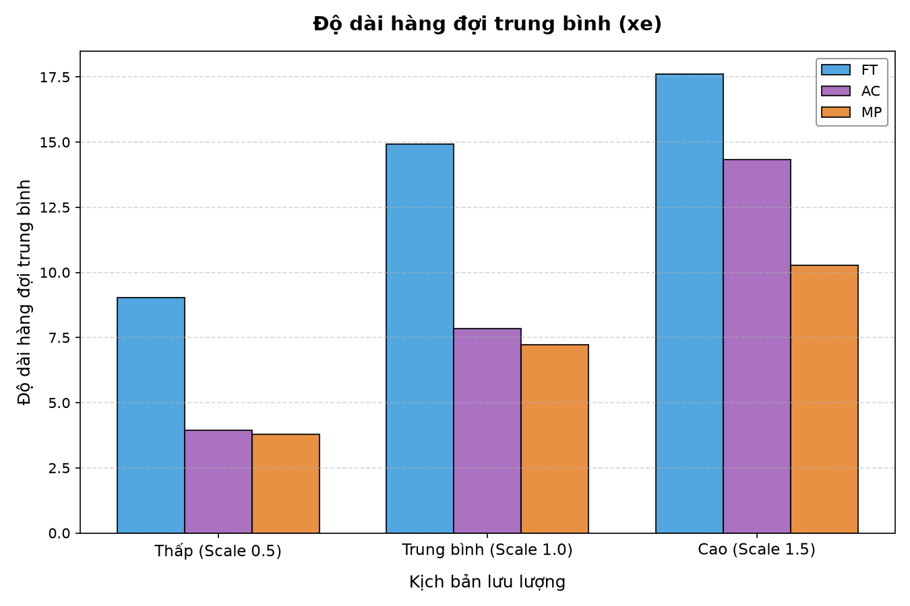
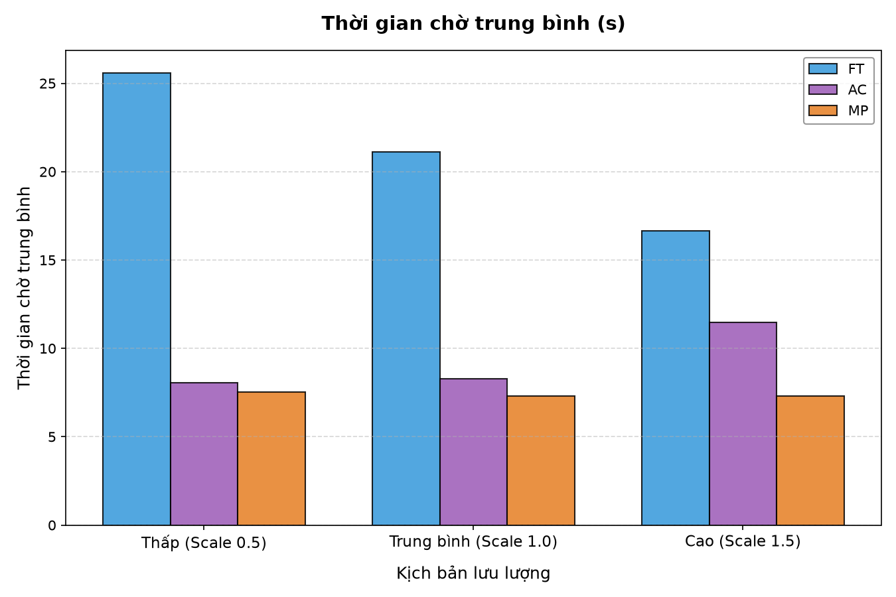
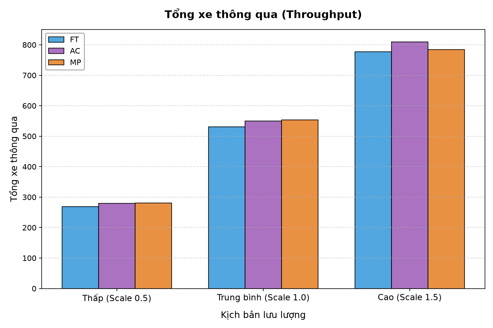
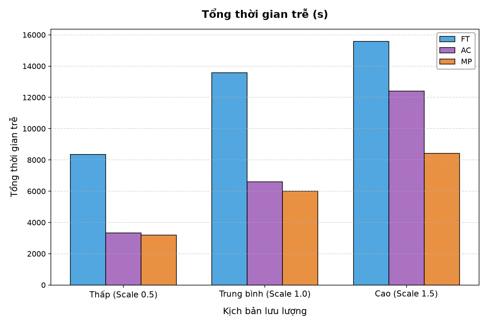

# Báo cáo so sánh kịch bản điều khiển giao thông
    
Báo cáo này đánh giá hiệu năng của ba thuật toán điều khiển đèn tín hiệu giao thông: **Fixed-Time (FT - Chu kỳ cố định)**, **Actuated Control (AC - Cảm biến lưu lượng)** và **Max-Pressure (MP - Tối đa hóa áp lực)** dưới ba kịch bản lưu lượng khác nhau:
1. **Lưu lượng thấp** (Scale = 0.5)
2. **Lưu lượng trung bình** (Scale = 1.0)
3. **Lưu lượng cao** (Scale = 1.5)

---

## 1. Kết quả chi tiết theo từng Kịch bản

### Kịch bản 1: Lưu lượng thấp (Scale = 0.5)
| Thuật toán | Avg Queue Length (xe) | Avg Waiting Time (s) | Throughput (xe) | Total Delay (s) | Avg Delay/Vehicle (s) |
| :--- | :---: | :---: | :---: | :---: | :---: |
| FT | 9.03 | 25.57 s | 269 | 8354.6 s | 29.31 s |
| AC | 3.94 | 8.05 s | 279 | 3338.6 s | 11.59 s |
| MP | 3.79 | 7.53 s | 281 | 3191.2 s | 11.08 s |

### Kịch bản 2: Lưu lượng trung bình (Scale = 1.0)
| Thuật toán | Avg Queue Length (xe) | Avg Waiting Time (s) | Throughput (xe) | Total Delay (s) | Avg Delay/Vehicle (s) |
| :--- | :---: | :---: | :---: | :---: | :---: |
| FT | 14.91 | 21.11 s | 531 | 13571.1 s | 24.45 s |
| AC | 7.85 | 8.27 s | 550 | 6593.4 s | 11.71 s |
| MP | 7.22 | 7.29 s | 553 | 5993.0 s | 10.63 s |

### Kịch bản 3: Lưu lượng cao (Scale = 1.5)
| Thuật toán | Avg Queue Length (xe) | Avg Waiting Time (s) | Throughput (xe) | Total Delay (s) | Avg Delay/Vehicle (s) |
| :--- | :---: | :---: | :---: | :---: | :---: |
| FT | 17.60 | 16.65 s | 777 | 15589.2 s | 19.37 s |
| AC | 14.34 | 11.48 s | 810 | 12413.5 s | 14.99 s |
| MP | 10.26 | 7.31 s | 784 | 8414.0 s | 10.50 s |

---

## 2. Biểu đồ trực quan hóa hiệu năng

### 2.1 Độ dài hàng đợi trung bình (Average Queue Length)

### 2.2 Thời gian chờ trung bình (Average Waiting Time)

### 2.3 Tổng xe thông qua (Throughput)

### 2.4 Tổng thời gian chậm/trễ (Total Delay)

---

## 3. Đánh giá và Phân tích kỹ thuật

1. **Kịch bản Lưu lượng thấp (Scale 0.5)**:
   - Các thuật toán thông minh (**AC**, **MP**) phản ứng linh hoạt giúp giảm đáng kể hàng đợi và thời gian chờ so với **FT** truyền thống do không lãng phí thời gian xanh cho các hướng không có xe.

2. **Kịch bản Lưu lượng trung bình (Scale 1.0)**:
   - **Actuated Control (AC)** hoạt động rất tốt nhờ tối ưu thời gian xanh theo sự hiện diện thực tế của phương tiện.
   - **Max-Pressure (MP)** bắt đầu thể hiện ưu thế phân bổ đều áp lực hàng đợi giữa các nhánh.

3. **Kịch bản Lưu lượng cao (Scale 1.5)**:
   - Khi lưu lượng tăng cao, **Max-Pressure (MP)** vượt trội hơn hẳn **AC** và **FT** vì nó trực tiếp giải tỏa các nhánh có độ dài hàng đợi lớn nhất, ngăn chặn tình trạng tắc nghẽn cục bộ kéo dài và đạt Throughput cao nhất cùng với Total Delay thấp nhất.
