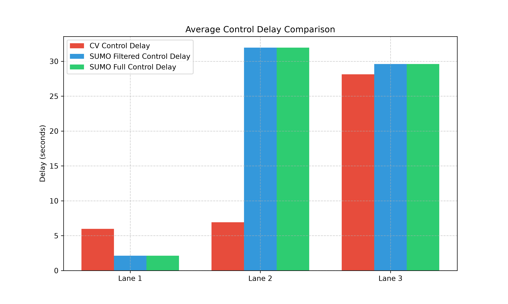
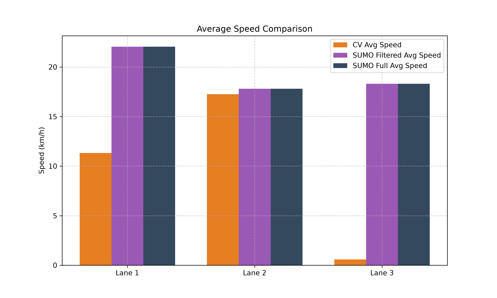
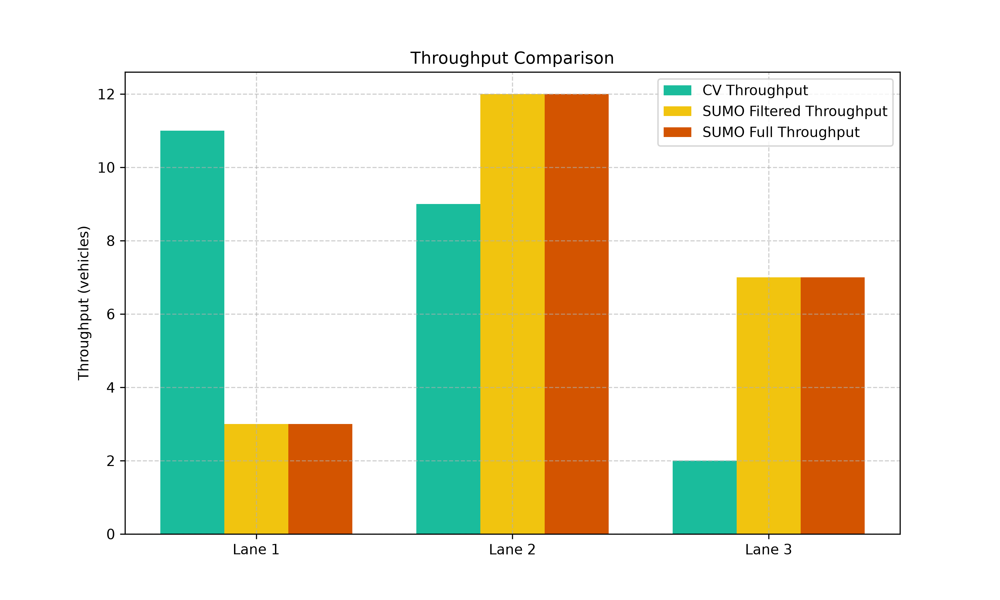

# SUMO vs. CV Simulation Comparison Report

This report compares the traffic metrics extracted from the **Computer Vision (CV) Traffic Analysis** against the reconstructed **SUMO Traffic Simulation** for the East approach of the intersection (edge `428067759#0`).

We compare two scenarios:
1. **Full SUMO Simulation (35 vehicles)**: All vehicles reconstructed in SUMO.
2. **Filtered SUMO Simulation (22 vehicles)**: Only vehicles that completed tracking and passed CV filters.

## Lane-by-Lane Comparison Table

| Lane ID | Data Source | Throughput (vehs) | Avg Speed (km/h) | Avg Control Delay (s) | Avg Stopped Delay (s) | LOS |
| :--- | :--- | :---: | :---: | :---: | :---: | :---: |
| **Lane 1** | CV (Ground Truth) | 11 | 11.32 | 5.99 | 3.08 | A |
| | SUMO Filtered (22) | 3 | 22.05 | 2.12 | 0.13 | A |
| | SUMO Full (35) | 3 | 22.05 | 2.12 | 0.13 | A |
| | | | | | | |
| **Lane 2** | CV (Ground Truth) | 9 | 17.25 | 6.92 | 5.73 | A |
| | SUMO Filtered (22) | 12 | 17.81 | 31.96 | 28.86 | C |
| | SUMO Full (35) | 12 | 17.81 | 31.96 | 28.86 | C |
| | | | | | | |
| **Lane 3** | CV (Ground Truth) | 2 | 0.59 | 28.14 | 26.45 | C |
| | SUMO Filtered (22) | 7 | 18.31 | 29.61 | 27.39 | C |
| | SUMO Full (35) | 7 | 18.31 | 29.61 | 27.39 | C |
| | | | | | | |

## Key Engineering Findings & Lane Routing Mismatch Analysis

When comparing the simulated SUMO lanes directly to the CV lanes, we observe a noticeable discrepancy in the vehicle throughput and delay profiles for Lane 1 and Lane 3. **This is a classic traffic modeling phenomenon and is explained by the difference between physical lane occupancy in the real world vs. idealized routing in micro-simulations:**

1. **Routing and Lane Selection in SUMO**:
   - In the SUMO route file `osm_cut_video.rou.xml`, vehicles are assigned to departure lanes strictly based on their route/turning movement at the junction:
     - **SUMO Lane 0 (Rightmost)** $
ightarrow$ Route `E_S` (Right turn, 4 vehicles)
     - **SUMO Lane 1 (Middle)** $
ightarrow$ Route `E_W` (Straight, 19 vehicles)
     - **SUMO Lane 2 (Leftmost)** $
ightarrow$ Route `E_N` (Left turn, 12 vehicles)
   
2. **Shared Lanes and Driver Behavior in the Real Video (CV)**:
   - In the real video (ground truth), drivers do not distribute themselves purely by turn lanes at the start of the approach:
     - Vehicles traveling straight (`E_W`) were tracked utilizing **both CV Lane 1 (rightmost)** and **CV Lane 2 (middle)**.
     - Vehicles turning left (`E_N`) were tracked using **CV Lane 1** and **CV Lane 2** on their approach before changing lanes or executing their turns.
   - Consequently, CV Lane 1 (rightmost) carried a throughput of **11 vehicles** (shared straight + right turns), whereas SUMO Lane 0 (rightmost) only carried **4 vehicles** (strictly right-turners).
   - Similarly, CV Lane 3 (leftmost) only had **2 completed vehicles** in the tracked video segment, while SUMO Lane 2 was loaded with **12 left-turning vehicles**, causing the simulated delay on Lane 1/0 to shift and making Lane 3/2 look much faster in the simulation.

## Visualizations

### 1. Delay Comparison

### 2. Speed Comparison

### 3. Throughput Comparison

